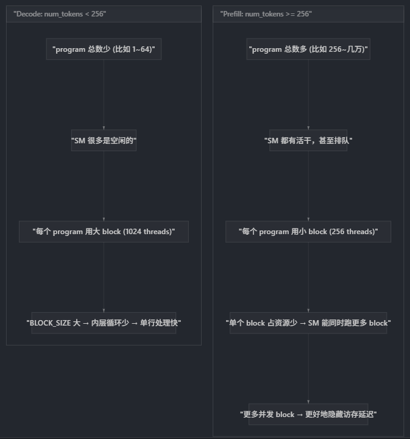

# RMSNorm benchmark实验
## 测试文件  

本次实验文件主要参考[benchmark_rmsnorm.py](./benchmark_rmsnorm.py)，该文件基于vLLM原始rmsnorm benchmark脚本进行功能添加，目前包含如下几种不同的kernel实现：  

* [PyTorch Naive](./benchmark_rmsnorm.py#L103-L150)
* [vLLM handwritten cuda kernel](./benchmark_rmsnorm.py#L177-L200)
* [FlashInfer Kernel](./benchmark_rmsnorm.py#L153-L174)
* [Triton Naive Impl](./benchmark_rmsnorm.py#L202-L348)
* [PyTorch Inductor Triton](./benchmark_rmsnorm.py#L351-L442)

> 声明：  
> * Triton Naive Kernel主要参考[Triton Tutorial CH5](https://triton-lang.org/main/getting-started/tutorials/05-layer-norm.html)的实现  
> * PyTorch Inductor Triton通过给PyTorch实现的RMSNorm添加`torch.compile` wrapper捕获得到，dump inductor的相关环境参数配置已经在[benchmark_rmsnorm.py](./benchmark_rmsnorm.py#L6-L9)中添加。

一些辅助script和最终的日志文件：  
* [ncu.sh](./ncu.sh)：用户可自行修改profile特定尺寸的rmsnorm triton 算子  
    - TODO：支持cuda算子的profiling
* [benchmark.log](./benchmark.log)：包含整个实验的最终结果  
* [ncu_rep.log](./ncu_rep.log)：包含ncu的log日志   
* [torch_compile_triton_dynamic.py](./torch_compile_triton_dynamic.py) & [torch_compile_triton_static.py](./torch_compile_triton_static.py)：测试torch.compile的dynamic参数的作用。

    > 注意：dynamic设定为true，生成的kernel更加灵活，设定为false，kernel针对特定shape，性能更好，但容易造成重编译开销。

## 选择  

面向硬件加速器实现一个高性能的kernel，难点可以大体分为如下方面：  
* 硬件资源利用率  
* Inference阶段input尺寸变化差异大  
    * Inference的shape一般为[batch_size, ...， seqlen，...]，prefill阶段和decode阶段batch_size可能会有较大差异，用户输入长短导致seqlen会有较大差异。  

为了在面对不同shape情况下，充分发掘硬件资源利用，编写kernel涉及大量选择难题。这里简要罗列benchmark中不同kernel

1. 选择1：是否使用2D tiling  
    * benchmark中的vLLM，triton实现，都遵循最简单的逻辑：一个threadBlocks处理一行，几个一个token，grid就是num_tokens。
    * inductor生成的triton使用2D tiling，即一个threadBlocks可能同时处理多行。其核心优势是weights权重加载可以多次复用，triton编译器会自动加载weight到smem，从而同一block的threads可以大量复用。此技巧详情参见[Triton Tutorial CH3](https://triton-lang.org/main/getting-started/tutorials/03-matrix-multiplication.html)。    
    > 注意：想要提高Triton代码的存储复用率，
2. 选择2：一个threadBlock有多少threads  
    这个选择，本质涉及如下tradeoff：
    * Block_Size小了，为了完成一行（即hidden_size）的rmsnorm计算，kernel代码内部for循环次数增多。 
    * Block_Size大了，则SM能够同时调度的block变少，无法overlap访问存储开销。  

    

    结合Inference场景：  
    > **Decode 场景**：只有几行数据（比如 batch=1, num_tokens=1）。GPU 上有 80~130 个 SM，大部分 SM 闲着。瓶颈是单行的处理速度，所以给每个 program 分配尽可能多的线程（1024），让 BLOCK_SIZE 尽量大，减少 for 循环次数，一行数据尽快处理完。

    > **Prefill 场景**：有成百上千行数据。SM 全部都有活干，甚至每个 SM 上排了好几个 block 等待执行。此时瓶颈是全局吞吐。每个 block 如果用 1024 线程，会占用大量寄存器和 shared memory，导致一个 SM 只能同时驻留 1-2 个 block。如果改用 256 线程，SM 可能同时驻留 4-8 个 block，当一个 block 在等内存数据时，SM 可以切换到另一个 block 执行——这就是 occupancy 带来的延迟隐藏。
3. 选择3：warp数目的选取  
    CUDA kernel 中用户直接控制 thread 层级，需要理解 GPU 的 warp 原理。Triton 则通过 `num_warps` 参数提供粗粒度控制能力。  

    warp 数目**不是**一个独立的选择——它由一条因果链推导而来：**LDG.128 → vec_size → threads → num_warps**。

    ```mermaid      
    flowchart LR
    A["目标: 用 LDG.128 (128-bit load)"] --> B["vec_size = 16 / element_size"]
    B --> C["每个线程一次处理 vec_size 个元素"]
    C --> D["threads = min(hidden_size / vec_size, max_threads)"]
    D --> E["num_warps = threads / 32"]
    ```

    **Step 1 — 确定 vec_size（向量化宽度）**  
    GPU global memory 加载指令有不同宽度：LDG.32 (4B)、LDG.64 (8B)、LDG.128 (16B)。LDG.128 吞吐最高，是优化目标。vec_size 表示单次 load 搬运的元素个数：  
    ```
    vec_size = 16 bytes / element_size
    ```
    - bf16/fp16 (2B/元素): vec_size = 8，即每个线程一次 load 读 8 个元素  
    - fp32 (4B/元素): vec_size = 4，即每个线程一次 load 读 4 个元素  

    对应 CUDA 源码 `csrc/layernorm_kernels.cu` 中的 `calculated_vec_size = std::gcd(16 / sizeof(scalar_t), hidden_size)`。

    **Step 2 — 确定 threads（线程数）**  
    已知每个线程一次处理 vec_size 个元素，那么覆盖一整行 (hidden_size 个元素) 需要多少线程？  
    ```
    threads = hidden_size / vec_size
    ```
    再 clamp 到 max_threads（由选择2中的 decode/prefill 策略决定），然后 round up 到 2 的幂（Triton 要求）。

    **Step 3 — 确定 num_warps（纯粹派生）**  
    GPU warp = 32 threads，确定了线程数就确定了 warp 数：  
    ```
    num_warps = threads / 32
    ```

    **具体数值推导** (hidden_size=4096, bf16)：

    | 参数 | Decode (num_tokens=4) | Prefill (num_tokens=1024) |
    |------|-----------------------|---------------------------|
    | max_threads | 1024 | 256 |
    | vec_size | 16/2 = 8 | 16/2 = 8 |
    | threads = min(4096/8, max) | min(512, 1024) = **512** | min(512, 256) = **256** |
    | num_warps | 512/32 = **16** | 256/32 = **8** |
    | BLOCK_SIZE = vec_size * threads | 8 * 512 = **4096** | 8 * 256 = **2048** |
    | 内层循环次数 = 4096/BLOCK_SIZE | **1 次** | **2 次** |

    **为什么 prefill 场景下 cap 在 8 warps (256 threads)?**

    硬件上限是 1024 threads/block = 32 warps（硬约束），但 prefill 场景主动选择了更低的 256 threads = 8 warps，原因有三：  
    1. **SM occupancy**：线程越多，每个 block 消耗的寄存器和 shared memory 越多，SM 能同时驻留的 block 就越少。256 threads 是 occupancy 与单 block 性能的经验平衡点——SM 可以同时驻留多个 block，当一个 block stall 在 memory 时切换到另一个，充分隐藏访存延迟。  
    2. **寄存器压力**：超过 8 warps 后，寄存器需求容易超过 SM 的寄存器文件容量，导致 register spilling（溢出到 local memory，即 L1/L2），访存开销从寄存器级（~1 cycle）退化到 cache 级（~30+ cycles），性能断崖式下降。  
    3. **与 CUDA 实现对齐**：vLLM 的 CUDA kernel（`csrc/layernorm_kernels.cu` L212）中 prefill 路径同样使用 `max_block_size = 256`，Triton 版本保持一致以获得可比的性能特征。  

    Inductor 风格的 kernel 在 autotune config 中也显式 `min(..., 8)` 来 cap warp 数：`num_warps = max(1, min(XBLOCK * R0_BLOCK // 512, 8))`，遵循同样的考量。

    > TODO：具体数值选取，值得进一步研究。

## Case Study

从 `典型shape输入例子（推理不同阶段）` x `不同参数配置的triton kernel（tradeoff选取）` x `ncu工具（定量分析）` 来进一步验证和指引kernel的编写。

## 有趣的尝试  
### Triton的autotune机制  
autotune，顾名思义就是排列组合各种参数配置，然后针对给定的shape输入大小下逐一尝试，得到最优配置。其有如下overhead：  

* 需要warmup，inference阶段如果无法cache hit，tune开销 + recompile开销难以接受。  
* 如何平衡kernel cache大小和运行时开销？

### FlashInfer的编译尝试
