# vLLM Attention 深度解析

```mermaid  
flowchart TD
    subgraph MODEL["① 模型层 (Model Layer)"]
        M1["Qwen3Attention / LlamaAttention\n等各模型 Attention 模块"]
        M2["self.attn = Attention(\n  num_heads, head_dim, scale,\n  cache_config, quant_config,\n  attn_type=DECODER\n)"]
        M3["self.attn.forward(query, key, value)"]
    end

    subgraph LAYER["② Attention 包装层\nvllm/model_executor/layers/attention/attention.py"]
        L1["Attention.__init__()"]
        L2["get_attn_backend(\n  head_size, dtype,\n  kv_cache_dtype, block_size,\n  use_mla, attn_type, ...\n)"]
        L3["self.attn_backend = FlashAttentionBackend\nimpl_cls = attn_backend.get_impl_cls()\nself.impl = FlashAttentionImpl(...)"]
        L4["Attention.forward(q, k, v)"]
        L5["unified_attention_with_output()\n或 self.impl.forward(q, k, v, kv_cache, attn_metadata)"]
    end

    subgraph SELECTOR["③ Backend 选择器\nvllm/v1/attention/selector.py"]
        S1["get_attn_backend()"]
        S2["构建 AttentionSelectorConfig\n(head_size, dtype, kv_cache_dtype,\nblock_size, use_mla, attn_type, ...)"]
        S3["_cached_get_attn_backend(\n  backend=vllm_config.attention_config.backend,\n  attn_selector_config\n)"]
        S4["current_platform.get_attn_backend_cls()\n→ resolve_obj_by_qualname(class_path)\n→ 返回 Backend 类"]
    end

    subgraph PLATFORM["④ 平台选择逻辑\nvllm/platforms/cuda.py :: CudaPlatform"]
        P1["get_attn_backend_cls(\n  selected_backend, attn_selector_config\n)"]
        P2{"selected_backend\n显式指定?"}
        P3["validate_configuration()\n检查兼容性"]
        P4["返回 selected_backend.get_path()"]
        P5["_get_backend_priorities(\n  use_mla, device_capability, num_heads\n)\n→ 按优先级排列候选列表"]
        P6["get_valid_backends()\n逐一调用 backend_class.validate_configuration()\n过滤不兼容的 backend"]
        P7["选最高优先级有效 backend\n返回其 class_path"]

        subgraph PRIO["优先级列表 (非MLA, sm_89/sm_90)"]
            direction LR
            PA["① FLASH_ATTN\n(默认首选)"]
            PB["② FLASHINFER"]
            PC["③ TRITON_ATTN"]
            PD["④ FLEX_ATTENTION"]
        end
    end

    subgraph REGISTRY["⑤ Backend 注册表\nvllm/v1/attention/backends/registry.py"]
        R1["AttentionBackendEnum\nFLASH_ATTN → FlashAttentionBackend\nFLASHINFER  → FlashInferBackend\nTRITON_ATTN → TritonAttentionBackend\n..."]
    end

    subgraph BACKEND["⑥ Backend 实现\nvllm/v1/attention/backends/flash_attn.py"]
        B1["FlashAttentionBackend\n(AttentionBackend 抽象类实现)\n- get_name() → 'FLASH_ATTN'\n- get_impl_cls() → FlashAttentionImpl\n- get_builder_cls() → FlashAttnMetadataBuilder\n- validate_configuration()"]
        B2["FlashAttentionImpl\n(AttentionImpl 实现)\n.forward(layer, q, k, v, kv_cache, attn_metadata)"]
    end

    subgraph KERNEL["⑦ CUDA Kernel 调用\nvllm/vllm_flash_attn/"]
        K1["reshape_and_cache_flash(\n  key, value,\n  key_cache, value_cache,\n  slot_mapping\n)\n→ 将 K/V 写入 Paged KV Cache"]
        K2["flash_attn_varlen_func(\n  q, k_cache, v_cache, out,\n  cu_seqlens_q, seqused_k,\n  block_table, causal=True, ...\n)\n→ FlashAttention-2/3 CUDA Kernel"]
        K3["输出: output tensor\n[num_tokens, num_heads × head_size]"]
    end

    %% 初始化流程
    M1 --> M2
    M2 --> L1
    L1 --> L2
    L2 --> S1
    S1 --> S2
    S2 --> S3
    S3 --> P1
    P1 --> P2
    P2 -- "是 (env VLLM_ATTENTION_BACKEND\n或 global forced backend)" --> P3
    P3 -- "通过" --> P4
    P2 -- "否 (自动选择)" --> P5
    P5 --> PRIO
    PRIO --> P6
    P6 --> P7
    P4 --> R1
    P7 --> R1
    R1 -- "get_path() → class_path\nresolve_obj_by_qualname()" --> S4
    S4 --> L3
    L3 --> B1
    B1 -- "get_impl_cls()" --> B2

    %% 推理流程
    M3 --> L4
    L4 --> L5
    L5 --> B2
    B2 --> K1
    K1 --> K2
    K2 --> K3

    %% 样式
    classDef initPhase fill:#dbeafe,stroke:#3b82f6,color:#1e3a5f
    classDef inferPhase fill:#dcfce7,stroke:#16a34a,color:#14532d
    classDef kernelBox fill:#fef9c3,stroke:#ca8a04,color:#713f12
    classDef platformBox fill:#f3e8ff,stroke:#9333ea,color:#3b0764
    classDef registryBox fill:#ffe4e6,stroke:#e11d48,color:#4c0519

    class M1,M2,L1,L2,L3,S1,S2,S3,S4,P1,P2,P3,P4,P5,P6,P7,R1,B1 initPhase
    class M3,L4,L5,B2 inferPhase
    class K1,K2,K3 kernelBox

```



| 层级 | 文件 | 职责 |
|------|------|------|
| ① 模型层 | `models/qwen3.py` 等 | 构造 `Attention(...)` 对象 |
| ② Attention 包装层 | `layers/attention/attention.py` | 调用 backend 选择，实例化 impl |
| ③ 选择器 | `v1/attention/selector.py` | 封装配置参数，走缓存查询 |
| ④ 平台逻辑 | `platforms/cuda.py` | 显式指定 → 验证；未指定 → 按优先级自动选 |
| ⑤ 注册表 | `backends/registry.py` | `AttentionBackendEnum` 维护名称 → class_path 映射 |
| ⑥ Backend 类 | `backends/flash_attn.py` | 抽象接口的具体实现，给出 Impl 类 |

> 代码路径索引：
> - [`vllm/model_executor/layers/attention/attention.py`](../../../vllm/model_executor/layers/attention/attention.py) — `Attention` nn.Module（层入口）
> - [`vllm/v1/attention/selector.py`](../../../vllm/v1/attention/selector.py) — Backend 选择逻辑
> - [`vllm/v1/attention/backend.py`](../../../vllm/v1/attention/backend.py) — 抽象接口定义
> - [`vllm/v1/attention/backends/`](../../../vllm/v1/attention/backends/) — 各 Backend 实现
> - [`vllm/v1/attention/ops/`](../../../vllm/v1/attention/ops/) — Triton Kernel
> - [`csrc/attention/`](../../../csrc/attention/) — CUDA Kernel

---

## 一、整体架构

vLLM 的 Attention 分两个层次：**层（Layer）** 负责参数管理与分派，**Backend/Impl** 负责具体计算。

```
Attention (nn.Module)                   ← 模型里直接调用的层
  ├─ __init__: 参数配置 + Backend 选定
  └─ forward: 量化预处理 → KV Cache 写入 → Attention 计算

      ↓ 通过 torch.ops.vllm.* 自定义算子调用

AttentionImpl.forward()                 ← Backend 具体实现
  ├─ FlashAttentionImpl   (flash_attn_varlen_func)
  ├─ TritonAttentionImpl  (Triton kernel)
  ├─ FlashInferImpl       (flashinfer wrapper)
  └─ MLA 系列             (MLA-specific path)
```

---

## 二、Init 阶段：参数配置

### 2.1 `Attention.__init__` 接收的参数

> 跳转：[`Attention.__init__`](../../../vllm/model_executor/layers/attention/attention.py#L189)

```python
Attention(
    num_heads,                     # Q 的 head 数量
    head_size,                     # 每个 head 的维度（通常 128）
    scale,                         # softmax 缩放系数，通常 1/sqrt(head_size)
    num_kv_heads,                  # KV 的 head 数（GQA/MQA 时 < num_heads）
    alibi_slopes,                  # ALiBi 位置编码的斜率（None 表示不用）
    cache_config,                  # KV Cache 配置（block_size, dtype, sliding_window 等）
    quant_config,                  # 量化配置（决定是否启用 FP8 KV Cache）
    logits_soft_cap,               # Gemma 系列用的 logit soft cap（None 表示关闭）
    per_layer_sliding_window,      # 层级 sliding window（覆盖 cache_config 的全局值）
    prefix,                        # 层名（用于 ForwardContext 索引，如 "model.layers.0.self_attn"）
    attn_type,                     # 注意力类型（见下表）
    kv_sharing_target_layer_name,  # KV 共享：复用某层的 KV Cache（不重复写入）
    head_size_v,                   # V 的 head 维度（MLA 等非对称场景中 V 维度不同）
    **extra_impl_args,             # 透传给 AttentionImpl（如 sinks、use_alibi_sqrt）
)
```

**[`attn_type`](../../../vllm/v1/attention/backend.py#L23) 的四个取值：**

| 值 | 含义 | KV Cache | 掩码 |
|---|---|---|---|
| `DECODER` | 标准自回归 decoder 自注意力 | ✅ 写入 | causal |
| `ENCODER` | Encoder-Decoder 模型的 encoder 部分 | ❌ | 双向 |
| `ENCODER_ONLY` | 纯 encoder 模型（BERT 类）| ❌ | 双向 |
| `ENCODER_DECODER` | Cross-attention（decoder 关注 encoder 的 KV）| ✅ | 无 causal |

### 2.2 Init 阶段的关键衍生配置

`__init__` 内部完成以下推导，后续 forward 直接使用：

**（1）Sliding Window 优先级**

```python
# per_layer_sliding_window > cache_config.sliding_window > None
sliding_window = per_layer_sliding_window or cache_config.sliding_window or None
```

**（2）KV Cache 量化 dtype**

> 跳转：[`_init_kv_cache_quant`](../../../vllm/model_executor/layers/attention/attention.py#L117)、[`set_default_quant_scales`](../../../vllm/model_executor/layers/attention/attention.py#L90)

```python
# "auto"    → 跟随激活 dtype（fp16/bf16）
# "fp8"     → FP8 KV Cache（需要 _k_scale / _v_scale 支持）
# "fp8_e4m3"→ 更精确的 FP8 格式
kv_cache_dtype = cache_config.cache_dtype  # or "fp8" if quant_config 指定
```

量化 scale 作为 buffer 注册到 state dict（`_q_scale`, `_k_scale`, `_v_scale`, `_prob_scale`），从 checkpoint 加载或初始化为 1.0。

**（3）三个影响 forward 行为的 flag**

| Flag | 来源 | 跳转 | 含义 |
|---|---|---|---|
| `use_output` | `attn_backend.accept_output_buffer` | [L339](../../../vllm/model_executor/layers/attention/attention.py#L339) | Backend 是否支持写入预分配 output tensor |
| `use_direct_call` | `not current_platform.opaque_attention_op()` | [L337](../../../vllm/model_executor/layers/attention/attention.py#L337) | 是否绕过 `torch.ops` 黑盒（非 CUDA 平台走此路径） |
| `forward_includes_kv_cache_update` | `attn_backend.forward_includes_kv_cache_update` | [L46](../../../vllm/v1/attention/backend.py#L46) | Backend 的 forward 是否内含 KV Cache 写入 |

**（4）FP8 Query 量化器**

> 跳转：[`query_quant` 初始化](../../../vllm/model_executor/layers/attention/attention.py#L366)

若 `kv_cache_dtype` 为 fp8 且 backend 支持量化 query 输入，则初始化 `self.query_quant`（`QuantFP8`），在 forward 时将 query 量化成 fp8 后再传入 kernel，允许 torch.compile 将量化 op 与前面的 linear 融合。

---

## 三、Init 阶段：Backend 选择

### 3.1 选择入口

> 跳转：[`get_attn_backend`](../../../vllm/v1/attention/selector.py#L48)、[`_cached_get_attn_backend`](../../../vllm/v1/attention/selector.py#L95)、[`AttentionSelectorConfig`](../../../vllm/v1/attention/selector.py#L21)

```python
# Attention.__init__ 调用（L275）：
self.attn_backend = get_attn_backend(
    head_size, dtype, kv_cache_dtype, block_size,
    use_mla, has_sink, use_mm_prefix,
    use_per_head_quant_scales, attn_type
)
```

`get_attn_backend` 内部将参数打包为 [`AttentionSelectorConfig`](../../../vllm/v1/attention/selector.py#L21)，用 `@cache` 装饰保证相同配置只选一次，然后委托给 `current_platform.get_attn_backend_cls()` 完成实际选择（平台决策）。

选定后还有一步后处理：若 backend 要求特定 KV Cache 内存布局（`NHD` vs `HND`），会调用 `set_kv_cache_layout()` 全局生效。

### 3.2 各 Backend 对比

> 跳转：[`AttentionBackendEnum`](../../../vllm/v1/attention/backends/registry.py#L34)

#### 标准 Attention（非 MLA）

| Backend | 底层库 | 跳转 | 优势 | 局限 |
|---|---|---|---|---|
| `FLASH_ATTN` | flash-attn 2/3 | [flash_attn.py](../../../vllm/v1/attention/backends/flash_attn.py#L58) | 默认首选，性能最高，支持 FA3 fp8 | 需要安装 flash-attn，MLA 不支持 |
| `FLASHINFER` | flashinfer | [flashinfer.py](../../../vllm/v1/attention/backends/flashinfer.py) | 量化格式最全（含 FP4/NVFP4），Prefill/Decode 分开优化 | 依赖 flashinfer 库，prefix caching + batch-invariant 暂不支持 |
| `TRITON_ATTN` | Triton kernel | [triton_attn.py](../../../vllm/v1/attention/backends/triton_attn.py) | 无外部依赖，兼容性最好，支持多模态 prefix | 性能略低于 flash-attn |
| `FLEX_ATTENTION` | PyTorch | [flex_attention.py](../../../vllm/v1/attention/backends/flex_attention.py) | 支持任意自定义 mask | 不支持 CUDA Graph，性能较低 |
| `CPU_ATTN` | PyTorch | [cpu_attn.py](../../../vllm/v1/attention/backends/cpu_attn.py) | CPU 推理 | 无 GPU 加速 |

**选择建议：**
- NVIDIA GPU + 标准场景 → `FLASH_ATTN`（默认）
- 需要 FP4/NVFP4 或 per-head FP8 scale → `FLASHINFER`
- flash-attn 安装失败 / ROCm / 新硬件 → `TRITON_ATTN`

#### MLA Attention（DeepSeek V2/V3/R1 专用）

MLA 将 KV 压缩为低秩潜在向量存储，KV Cache 节省约 5-6×。计算时有两条路径：
- **MHA 路径**（Prefill）：将 latent KV 展开回完整 K/V，再做标准 MHA
- **MQA 路径**（Decode）：利用矩阵结合律，Q 与 W_UK 预先结合，避免展开全部历史 K

| Backend | 硬件 | 跳转 | Decode 内核 | 特点 |
|---|---|---|---|---|
| `TRITON_MLA` | 通用 GPU | [triton_mla.py](../../../vllm/v1/attention/backends/mla/triton_mla.py) | Triton | 最兼容，无特殊依赖 |
| `FLASHMLA` | A100/H100 | [flashmla.py](../../../vllm/v1/attention/backends/mla/flashmla.py) | FlashMLA | 专用 MLA 高性能内核 |
| `FLASH_ATTN_MLA` | H100 | [flashattn_mla.py](../../../vllm/v1/attention/backends/mla/flashattn_mla.py) | FA3 | 需 FA3，支持 FP8 |
| `FLASHINFER_MLA` | A100/H100 | [flashinfer_mla.py](../../../vllm/v1/attention/backends/mla/flashinfer_mla.py) | FlashInfer | 量化支持好 |
| `CUTLASS_MLA` | Blackwell (sm_100) | [cutlass_mla.py](../../../vllm/v1/attention/backends/mla/cutlass_mla.py) | CUTLASS SM100 | 最高性能，仅限 Blackwell |
| `ROCM_AITER_MLA` | AMD | [rocm_aiter_mla.py](../../../vllm/v1/attention/backends/mla/rocm_aiter_mla.py) | AITER | AMD 专用 |

### 3.3 Backend 的能力声明接口

> 跳转：[`AttentionBackend` 基类](../../../vllm/v1/attention/backend.py#L46)

Backend 类通过类方法声明自身能力，selector 在选择时用于过滤：

```python
class AttentionBackend(ABC):
    @classmethod def supported_dtypes(cls) -> list[torch.dtype]
    @classmethod def supported_kv_cache_dtypes(cls) -> list[str]
    @classmethod def supports_head_size(cls, head_size: int) -> bool
    @classmethod def supports_block_size(cls, block_size: int) -> bool
    @classmethod def supports_sink(cls) -> bool           # StreamingLLM Sink Token
    @classmethod def supports_attn_type(cls, t) -> bool
    @classmethod def supports_compute_capability(cls, cc) -> bool
    @classmethod def is_mla(cls) -> bool
    @classmethod def is_sparse(cls) -> bool
```

---

## 四、Forward 阶段

### 4.1 完整执行流

> 跳转：[`Attention.forward`](../../../vllm/model_executor/layers/attention/attention.py#L381)

```
Attention.forward(query, key, value)
│
├─ [可选] maybe_calc_kv_scales()        # 动态计算 FP8 scale（仅首次 forward）
├─ [可选] query_quant(query, _q_scale)  # FP8 query 量化（允许 torch.compile 融合）
│
├─ reshape: [tokens, hidden] → [tokens, heads, head_size]
│
├─ [条件] unified_kv_cache_update(key, value, layer_name)
│         → impl.do_kv_cache_update()
│         → reshape_and_cache_flash()   # 写入 Paged KV Cache
│         → 返回 dummy_dep tensor（建立数据依赖）
│
└─ unified_attention_with_output(query, key, value, output, layer_name,
                                 kv_cache_dummy_dep=dummy_dep)
      → impl.forward(layer, q, k, v, kv_cache, attn_metadata, output)
```

### 4.2 量化处理

#### FP8 KV Cache

KV Cache 以 FP8 格式存储，读写时通过 scale 还原：

- **写入**：[`unified_kv_cache_update`](../../../vllm/model_executor/layers/attention/attention.py#L645) → [`do_kv_cache_update`](../../../vllm/v1/attention/backends/flash_attn.py#L770) → `reshape_and_cache_flash`：将 bf16/fp16 的 key/value 量化写入
- **读取（Attention 计算）**：flash-attn 接受 `k_descale`/`v_descale` 参数，shape 为 `(num_sequences, num_kv_heads)`，通过 `.expand()` 从标量广播（零拷贝）：

```python
# flash_attn.py L690
descale_shape = (num_sequences, self.num_kv_heads)
k_descale = layer._k_scale.expand(descale_shape)   # 不分配新内存
```

#### FP8 Query 量化

> 跳转：[query_quant 初始化](../../../vllm/model_executor/layers/attention/attention.py#L366)、[forward 调用](../../../vllm/model_executor/layers/attention/attention.py#L403)

```python
# forward 里：
query, _ = self.query_quant(query, self._q_scale)
# 这是一个普通 torch 算子，torch.compile 可以将其与前面的 q_proj linear 融合
# 避免了单独的量化 kernel launch overhead
```

#### 动态 Scale 计算

> 跳转：[`maybe_calc_kv_scales`](../../../vllm/model_executor/layers/attention/attention.py#L546)、[`calc_kv_scales`](../../../vllm/model_executor/layers/attention/attention.py#L485)

`calculate_kv_scales=True` 时（calibration 阶段），会在**首次** forward 时统计 q/k/v 的 abs_max 动态计算 scale，之后 `calculate_kv_scales` 置为 False 固定。

### 4.3 CUDA Graph 集成

CUDA Graph 要求 forward 期间没有 CPU 端分支、动态形状或 Python 副作用。vLLM 通过以下设计支持：

**（1）`ForwardContext` 传递运行时状态**

> 跳转：[`get_attention_context`](../../../vllm/model_executor/layers/attention/attention.py#L580)

`attn_metadata`、`kv_cache`、`slot_mapping` 不通过参数传递，而是在 graph 录制前通过 `set_forward_context()` 写入全局上下文，graph 执行时直接读取：

```python
# graph 内部（attention.py L601-L613）：
forward_context = get_forward_context()
attn_metadata = forward_context.attn_metadata   # 不是 graph 输入
kv_cache = attn_layer.kv_cache[forward_context.virtual_engine]
```

**（2）attention 注册为不透明 custom op**

> 跳转：[`unified_attention_with_output` 注册](../../../vllm/model_executor/layers/attention/attention.py#L729)

在 CUDA 平台，attention 调用走 `torch.ops.vllm.unified_attention_with_output`，对 `torch.compile` 完全不透明，不会被内联分析，确保 graph capture 时的行为与 eager 一致。

**（3）`kv_cache_dummy_dep` 保序**

> 跳转：[`unified_kv_cache_update` 注册](../../../vllm/model_executor/layers/attention/attention.py#L678)、[forward 中的调用](../../../vllm/model_executor/layers/attention/attention.py#L436)

KV Cache 写入（`unified_kv_cache_update`）和 attention forward（`unified_attention_with_output`）都通过自定义 op 注册，两者之间通过 dummy tensor 建立假数据依赖，阻止 `torch.compile` / CUDA Graph 重排序：

```python
kv_cache_dummy_dep = torch.ops.vllm.unified_kv_cache_update(key, value, layer_name)
# ↑ 这个 dummy tensor 作为参数传给 attention，但内部会 del 掉（L700）
torch.ops.vllm.unified_attention_with_output(..., kv_cache_dummy_dep=kv_cache_dummy_dep)
```

**（4）Backend 声明 CUDA Graph 支持级别**

> 跳转：[`AttentionCGSupport`](../../../vllm/v1/attention/backend.py#L423)

```python
class AttentionCGSupport(Enum):
    ALWAYS                       = 3  # 完整支持所有 batch 类型
    UNIFORM_BATCH                = 2  # 仅支持同质 batch（如 spec-decode）
    UNIFORM_SINGLE_TOKEN_DECODE  = 1  # 仅支持纯 decode batch（所有请求各 1 token）
    NEVER                        = 0  # 不支持 CUDA Graph
```

### 4.4 Cascade Attention（前缀共享优化）

> 跳转：[FlashAttentionImpl.forward cascade 路径](../../../vllm/v1/attention/backends/flash_attn.py#L741)、[`merge_attn_states` dispatch](../../../vllm/v1/attention/ops/merge_attn_states.py)

当 batch 内所有请求共享公共前缀（prefix caching）时，触发 cascade 路径：

```
1. flash_attn_varlen_func(query → prefix KV cache)  → prefix_out, prefix_lse
2. flash_attn_varlen_func(query → suffix KV cache)  → suffix_out, suffix_lse
3. merge_attn_states(output, prefix_out, prefix_lse, suffix_out, suffix_lse)
```

`merge_attn_states` 利用 online softmax 的数值稳定合并公式：

```
max_lse  = max(prefix_lse, suffix_lse)
p_weight = exp(prefix_lse - max_lse)
s_weight = exp(suffix_lse - max_lse)
output   = (p_weight * prefix_out + s_weight * suffix_out) / (p_weight + s_weight)
```

dispatch 逻辑：CUDA 平台用 [CUDA kernel](../../../csrc/attention/merge_attn_states.cu)（128-bit 向量化读写），其他情况 fallback 到 [Triton kernel](../../../vllm/v1/attention/ops/triton_merge_attn_states.py)。

---

## 五、扩展机制

### 5.1 `torch.ops.vllm` 自定义算子注册

> 跳转：[`direct_register_custom_op`](../../../vllm/utils/torch_utils.py#L757)、[vLLM 内的注册示例](../../../vllm/model_executor/layers/attention/attention.py#L638)

vLLM 将 attention 相关操作注册为 PyTorch 自定义算子，使其对 `torch.compile` 不透明。注册方式：

```python
from vllm.utils.torch_utils import direct_register_custom_op

def my_attention_func(query, key, value, layer_name):
    # 实际执行逻辑
    ...
    return output

def my_attention_fake(query, key, value, layer_name):
    # fake impl：仅描述输出 shape/dtype，供 torch.compile 的符号推导使用
    return torch.empty_like(query)

direct_register_custom_op(
    op_name="my_attention",
    op_func=my_attention_func,
    fake_impl=my_attention_fake,
    mutates_args=[],   # 声明哪些参数被原地修改（影响 torch.compile 的别名分析）
)
# 注册后通过 torch.ops.vllm.my_attention(...) 调用
```

**关键点：**
- `fake_impl` 必须正确返回输出的 shape/dtype，torch.compile 用它做形状推导，不执行真正计算
- `mutates_args` 必须准确声明，漏报会导致 CUDA Graph 下内存分析错误
- 注册为 custom op 的函数内部可以读取 `ForwardContext` 等运行时状态，不会被 compile 内联展开

### 5.2 添加新的 Attention Backend

> 跳转：[`AttentionBackend`](../../../vllm/v1/attention/backend.py#L46)、[`AttentionImpl`](../../../vllm/v1/attention/backend.py#L687)、[`AttentionMetadataBuilder`](../../../vllm/v1/attention/backend.py#L440)、[`CommonAttentionMetadata`](../../../vllm/v1/attention/backend.py#L294)

#### 第一步：实现三个类

```python
# 1. Backend 类 —— 能力声明 + 工厂方法
class MyBackend(AttentionBackend):
    accept_output_buffer = True                   # 是否支持预分配 output
    forward_includes_kv_cache_update = False      # forward 是否内含 KV 写入

    @staticmethod
    def get_name() -> str: return "MY_BACKEND"

    @staticmethod
    def get_impl_cls(): return MyBackendImpl

    @staticmethod
    def get_builder_cls(): return MyBackendBuilder

    @staticmethod
    def get_kv_cache_shape(num_blocks, block_size, num_kv_heads, head_size, **kw):
        return (2, num_blocks, block_size, num_kv_heads, head_size)

    # 能力声明（选择器用于过滤）
    @classmethod
    def supported_dtypes(cls): return [torch.float16, torch.bfloat16]

    @classmethod
    def supports_head_size(cls, head_size): return head_size in [64, 128, 256]


# 2. Impl 类 —— 实际计算逻辑
class MyBackendImpl(AttentionImpl[MyMetadata]):
    def __init__(self, num_heads, head_size, scale, num_kv_heads,
                 alibi_slopes, sliding_window, kv_cache_dtype, ...):
        self.num_heads = num_heads
        # ... 保存超参数

    def forward(self, layer, query, key, value, kv_cache,
                attn_metadata: MyMetadata, output=None, **kw):
        # ... 实际 attention 计算，写入 output
        return output

    def do_kv_cache_update(self, layer, key, value, kv_cache, slot_mapping):
        # 若 forward_includes_kv_cache_update=False，需实现此方法
        reshape_and_cache_flash(key, value, *kv_cache.unbind(0), slot_mapping, ...)


# 3. MetadataBuilder 类 —— 每个 batch 构建 metadata
class MyBackendBuilder(AttentionMetadataBuilder[MyMetadata]):
    _cudagraph_support = AttentionCGSupport.ALWAYS

    def build(self, common_prefix_len, common_attn_metadata, fast_build=False):
        # 从 common_attn_metadata 提取所需信息，构建 backend 专属 metadata
        return MyMetadata(
            num_actual_tokens=common_attn_metadata.num_actual_tokens,
            ...
        )
```

#### 第二步：注册 Backend

> 跳转：[`register_backend`](../../../vllm/v1/attention/backends/registry.py#L209)

**方式一：直接加入枚举**（需修改 vLLM 源码，[`AttentionBackendEnum`](../../../vllm/v1/attention/backends/registry.py#L34)）

```python
class AttentionBackendEnum(Enum):
    ...
    MY_BACKEND = "my_module.MyBackend"
```

**方式二：通过 `register_backend` 插件注册**（推荐，不修改源码）

```python
from vllm.v1.attention.backends.registry import register_backend, AttentionBackendEnum

register_backend(AttentionBackendEnum.CUSTOM, "my_module.MyBackend")
```

#### 第三步：通过 Platform 挂载选择逻辑

若要让 `get_attn_backend()` 自动选到你的 backend，需在自定义 Platform 中实现：

```python
class MyPlatform(Platform):
    def get_attn_backend_cls(self, backend, attn_selector_config, num_heads):
        # 根据 attn_selector_config 的参数决定返回哪个 backend 的类路径
        return "my_module.MyBackend"
```

---

## 附录：关键文件索引

| 文件 | 跳转 | 作用 |
|---|---|---|
| `model_executor/layers/attention/attention.py` | [跳转](../../../vllm/model_executor/layers/attention/attention.py) | `Attention` nn.Module、custom op 注册（`unified_attention_with_output` 等） |
| `model_executor/layers/attention/mla_attention.py` | [跳转](../../../vllm/model_executor/layers/attention/mla_attention.py) | MLA 层实现（prefill MHA / decode MQA 双路径） |
| `v1/attention/selector.py` | [跳转](../../../vllm/v1/attention/selector.py) | `get_attn_backend()` 入口，`@cache` 缓存选择结果 |
| `v1/attention/backend.py` | [跳转](../../../vllm/v1/attention/backend.py) | `AttentionBackend` / `AttentionImpl` / `AttentionMetadataBuilder` 抽象基类 |
| `v1/attention/backends/registry.py` | [跳转](../../../vllm/v1/attention/backends/registry.py) | `AttentionBackendEnum` 枚举与 `register_backend` |
| `v1/attention/backends/flash_attn.py` | [跳转](../../../vllm/v1/attention/backends/flash_attn.py) | FlashAttention backend（默认 CUDA 首选） |
| `v1/attention/backends/triton_attn.py` | [跳转](../../../vllm/v1/attention/backends/triton_attn.py) | 纯 Triton backend（无外部依赖） |
| `v1/attention/backends/flashinfer.py` | [跳转](../../../vllm/v1/attention/backends/flashinfer.py) | FlashInfer backend（量化格式最全） |
| `v1/attention/backends/mla/` | [跳转](../../../vllm/v1/attention/backends/mla/) | 各 MLA backend 实现 |
| `v1/attention/ops/triton_prefill_attention.py` | [跳转](../../../vllm/v1/attention/ops/triton_prefill_attention.py) | Triton prefill kernel（varlen flash attention） |
| `v1/attention/ops/triton_unified_attention.py` | [跳转](../../../vllm/v1/attention/ops/triton_unified_attention.py) | Triton paged decode kernel（prefill/decode 统一） |
| `v1/attention/ops/merge_attn_states.py` | [跳转](../../../vllm/v1/attention/ops/merge_attn_states.py) | `merge_attn_states` dispatch（CUDA/Triton） |
| `csrc/attention/paged_attention_v1/v2.cu` | [跳转](../../../csrc/attention/) | Legacy CUDA paged attention（fallback） |
| `csrc/attention/merge_attn_states.cu` | [跳转](../../../csrc/attention/merge_attn_states.cu) | CUDA LSE 合并 kernel（128-bit 向量化） |
| `csrc/attention/mla/sm100_cutlass_mla_kernel.cu` | [跳转](../../../csrc/attention/mla/sm100_cutlass_mla_kernel.cu) | Blackwell CUTLASS MLA kernel（TMA + warp spec） |
| `utils/torch_utils.py` | [跳转](../../../vllm/utils/torch_utils.py#L757) | `direct_register_custom_op` 注册工具函数 |
