# vLLM Plugin 开发文档

vLLM 提供高效的用户 plugin 机制，允许用户以 out-of-tree 的方式开发特定功能。本文档参考
[IBM vllm-triton-attention](https://github.com/foundation-model-stack/vllm-triton-backend)
插件，解读 plugin 注册流程以及自定义 Attention Backend 的完整集成方式。

---

## 目录

1. [插件集成流程](#1-插件集成流程)
   - 1.1 [vLLM 感知插件：入口注册](#11-vllm-感知插件入口注册)
   - 1.2 [平台类：劫持 Backend 选择](#12-平台类劫持-backend-选择)
2. [Attention 模块接口解读](#2-attention-模块接口解读)
   - 2.1 [AttentionBackend：后端工厂类](#21-attentionbackend后端工厂类)
   - 2.2 [三个核心类解读](#22-三个核心类解读)
     - [AttentionMetadata：每批次的工作清单](#attentionmetadata每批次的工作清单)
     - [AttentionMetadataBuilder：每批次的翻译器](#attentionmetadatabuilder每批次的翻译器)
     - [AttentionImpl：每层的执行者](#attentionimpl每层的执行者)
3. [vLLM Attention 集成框架](#3-vllm-attention-集成框架)
   - 3.1 [整体流程图](#31-整体流程图)
   - 3.2 [关键设计原则](#32-关键设计原则)
4. [附录：实现最小清单](#附录实现一个自定义-attention-plugin-的最小清单)

---

## 1. 插件集成流程

整个集成流程分为两个阶段：

- **安装期**：让 vLLM 知道这个插件的存在
- **运行期**：vLLM 调用插件提供的 attention 接口

### 1.1 vLLM 感知插件：入口注册

vLLM 通过 Python 标准的 [entry_points](https://packaging.python.org/en/latest/specifications/entry-points/)
机制发现插件。参考 [vLLM 插件文档](https://docs.vllm.ai/en/latest/design/plugin_system/#how-vllm-discovers-plugins)。

**第一步**：在 `setup.py` 中声明 entry_point，告诉 Python 包管理器"这是一个 vLLM 插件"：

```python
# setup.py
setup(
    name="ibm_triton_lib",
    ...
    entry_points={
        "vllm.platform_plugins": [
            "triton_attn = ibm_triton_lib.backend:register"
        ]
    },
)
```

**第二步**：在 `ibm_triton_lib/backend/__init__.py` 中定义 `register()` 函数，返回自定义 Platform 类的完整路径：

```python
# ibm_triton_lib/backend/__init__.py
def register():
    """Register the triton attention platform."""
    return "ibm_triton_lib.backend.platform.TritonPlatform"
```

vLLM 进程启动时会扫描所有 `vllm.platform_plugins` entry points，依次调用 `register()`，
根据返回的字符串动态加载对应的 Platform 类，替换 vLLM 的默认平台实现。

### 1.2 平台类：劫持 Backend 选择

Platform 类是连接 vLLM 框架与自定义 Attention 实现的桥梁。它继承自
`CudaPlatform`（NVIDIA）或 `RocmPlatform`（AMD），只需覆盖
`get_attn_backend_cls()` 这一个方法，即可将所有 attention 调用路由到自定义实现：

```python
# ibm_triton_lib/backend/platform.py
from vllm.platforms.cuda import CudaPlatform

class TritonPlatform(CudaPlatform):

    @classmethod
    def get_attn_backend_cls(
        cls,
        selected_backend,
        head_size,
        dtype,
        kv_cache_dtype,
        block_size,
        use_v1,
        use_mla,
    ) -> str:
        if not envs.VLLM_USE_V1:
            raise RuntimeError("vllm-triton-backend plugin only supports vLLM V1")
        return "ibm_triton_lib.backend.triton_attn.TritonAttentionBackend"
```

> **注意**：该插件仅支持 vLLM V1 引擎，需设置环境变量 `VLLM_USE_V1=1`。

---

## 2. Attention 模块接口解读

### 2.1 AttentionBackend：后端工厂类

`AttentionBackend` 是一个纯静态工厂类，不持有任何状态，负责告诉 vLLM 框架：

- KV Cache 应该分配成什么形状
- 用哪个类来构建 per-batch 的 metadata
- 用哪个类来执行每层的 attention 计算

```python
# ibm_triton_lib/backend/triton_attn.py
class TritonAttentionBackend(AttentionBackend):

    # 表示调用方需要预分配 output tensor 并传入，避免 forward 内部分配显存
    accept_output_buffer: bool = True

    @classmethod
    def get_supported_head_sizes(cls) -> list[int]:
        return [32, 64, 96, 128, 160, 192, 224, 256]

    @staticmethod
    def get_name() -> str:
        return "TRITON_ATTN_VLLM_V1"

    @staticmethod
    def get_impl_cls() -> type["TritonAttentionImpl"]:
        # 指定每层 attention forward 的执行类
        return TritonAttentionImpl

    @staticmethod
    def get_metadata_cls() -> type["AttentionMetadata"]:
        # 指定 per-batch metadata 的数据类
        return TritonAttentionMetadata

    @staticmethod
    def get_kv_cache_shape(
        num_blocks: int,
        block_size: int,
        num_kv_heads: int,
        head_size: int,
    ) -> tuple[int, ...]:
        if block_size % 16 != 0:
            raise ValueError("Block size must be a multiple of 16.")
        # layout: [0]=K, [1]=V，对 Triton kernel 内存访问友好
        return (2, num_blocks, block_size, num_kv_heads, head_size)

    @staticmethod
    def use_cascade_attention(*args, **kwargs) -> bool:
        return False

    @staticmethod
    def get_builder_cls() -> type["TritonAttentionMetadataBuilder"]:
        # 指定 metadata 的构建类
        return TritonAttentionMetadataBuilder
```

核心是用户需要自行实现 `MetadataBuilder`、`MetaData`、`AttentionImpl`
这三个类。它们是实现一个自定义 attention 的最小必要接口。

---

### 2.2 三个核心类解读

这三个类各司其职，形成一条"准备 → 执行"的完整流水线：

```
Scheduler（调度决策）
    ↓
MetadataBuilder.build()     ← 翻译器：把调度信息转成 GPU Tensor
    ↓
AttentionMetadata           ← 工作清单：打包所有 per-batch 信息
    ↓
AttentionImpl.forward()     ← 执行者：调用 Triton kernel 完成计算
```

---

#### `AttentionMetadata`：每批次的"工作清单"

这是一个纯数据类（`dataclass`），不包含任何计算逻辑。它的作用是把每次
forward 所需的所有 per-batch 信息打包，传递给底层 kernel。

```python
@dataclass
class TritonAttentionMetadata:
    # ── 基础信息 ──────────────────────────────────────────────────
    num_actual_tokens: int        # 本批次有效 token 总数（不含 padding）
    max_query_len: int            # batch 中最长的 query 序列长度
    avg_query_len: int            # query 长度均值（供 autotuner 选配置用）
    avg_seq_len: int              # KV 序列长度均值（供 autotuner 选配置用）

    # ── KV Cache 寻址 ─────────────────────────────────────────────
    slot_mapping: torch.Tensor    # shape [num_tokens]
                                  # 第 i 个新 token 应写入哪个物理 KV slot
                                  # slot = block_id * block_size + offset_in_block

    block_table: torch.Tensor     # shape [num_reqs, max_blocks_per_seq]
                                  # block_table[i][j] = 序列 i 的第 j 个逻辑 block
                                  # 对应的物理 block id

    # ── 序列分段信息 ───────────────────────────────────────────────
    query_start_loc: torch.Tensor # shape [num_reqs+1]，cumulative sum
                                  # 告诉 kernel 每条序列的 Q tokens 从哪里开始
    seq_lens: torch.Tensor        # shape [num_reqs]，每条序列的 KV 总长度
    max_seq_len: int

    # ── 可选扩展 ───────────────────────────────────────────────────
    use_cascade: bool             # 是否启用共享前缀 Cascade Attention 优化
    local_attn_metadata: ...      # iRoPE / sliding window 的虚拟批次信息
```

**关键设计**：`slot_mapping` 是"写地址表"（新 token 写入哪个位置），
`block_table` 是"读地址表"（历史 KV 从哪里读取）。二者共同解决了
Paged KV Cache 的非连续物理内存寻址问题。

以一个简单的 3 请求批次为例：

```
请求 A：prefill，query_len=512，seq_len=512
请求 B：decode， query_len=1,   seq_len=4096
请求 C：prefill，query_len=128，seq_len=128

query_start_loc = [0, 512, 513, 641]   ← 累积 query token 数
seq_lens        = [512, 4096, 128]     ← 各序列的 KV 总长
num_actual_tokens = 641                ← 本批次总 query token 数
```

---

#### `AttentionMetadataBuilder`：每批次的"翻译器"

在每次 forward **之前**，由 `GPUModelRunner._prepare_inputs()` 调用。
职责是把调度器的高层决策（哪些请求、各多少 token、分配了哪些内存块）
翻译成 GPU kernel 可以直接使用的 Tensor。

```python
class TritonAttentionMetadataBuilder(
    AttentionMetadataBuilder[TritonAttentionMetadata]
):
    def __init__(self, runner, kv_cache_spec, block_table):
        self.runner = runner          # 持有 GPUModelRunner 引用，访问 seq_lens 等 numpy 数组
        self.block_table = block_table

    def build(
        self, common_prefix_len, common_attn_metadata
    ) -> TritonAttentionMetadata:

        # 1. 在 CPU 侧计算统计量（numpy，低开销）
        #    这些值取 next_power_of_2 后作为 autotuner 的 key，
        #    决定 kernel 使用哪套 BLOCK_M/BLOCK_N 配置
        max_seq_len   = self.runner.seq_lens_np[:num_reqs].max()
        avg_seq_len   = self.runner.seq_lens_np[:num_reqs].mean()
        avg_query_len = total_tokens / num_reqs

        # 2. 将 slot_mapping 从 CPU 拷贝到 GPU（non_blocking，与 GPU 计算 overlap）
        block_table.slot_mapping[:num_actual_tokens].copy_(
            block_table.slot_mapping_cpu[:num_actual_tokens],
            non_blocking=True
        )

        # 3. 取当前批次需要的 block_table 切片
        block_table_tensor = block_table.get_device_tensor()[:num_reqs]

        # 4. （可选）iRoPE：将真实序列切成滑动窗口虚拟批次
        #    用于支持 Llama 4 等 Local Attention 模型
        if self.runner.attention_chunk_size is not None:
            local_attn_metadata = make_local_attention_virtual_batches(...)

        # 5. （可选）Cascade Attention：拆分公共前缀与各自后缀
        #    当 batch 中所有请求共享同一段 system prompt 时启用
        if common_prefix_len > 0:
            prefix_kv_lens = [common_prefix_len]
            suffix_kv_lens = seq_lens - common_prefix_len

        # 6. 打包返回
        return TritonAttentionMetadata(...)

    def build_for_cudagraph_capture(self, common_attn_metadata):
        # CUDA Graph 捕获时调用：
        # Tensor 形状必须与推理时一致（Graph 绑定形状），
        # 但将 seq_lens 填为 1 避免捕获时计算量过大导致超时
        attn_metadata = self.build(0, common_attn_metadata)
        attn_metadata.seq_lens.fill_(1)
        return attn_metadata
```

**关键设计**：同一个 KV cache group 内的所有 attention 层（如 LLaMA 的 32 层）
共享**同一个** `attn_metadata` 对象，`build()` 只调用一次，
通过 `forward_context` 广播给所有层，彻底消除重复计算。

---

#### `AttentionImpl`：每层的"执行者"

模型 forward 时，每个 attention 层都会调用 `impl.forward()`，
这是真正执行 GPU 计算的地方。

```python
class TritonAttentionImpl(AttentionImpl):

    def __init__(
        self, num_heads, head_size, scale, num_kv_heads,
        alibi_slopes, sliding_window, kv_cache_dtype,
        logits_soft_cap, use_irope, ...
    ):
        # 保存层级固定参数，整个模型生命周期不变
        self.scale = scale
        self.sliding_window = sliding_window
        self.use_irope = use_irope
        ...

    def forward(
        self, layer, query, key, value,
        kv_cache, attn_metadata, output     # output 由调用方预分配，原地写入
    ) -> torch.Tensor:
        # query:    [num_tokens, num_heads, head_size]
        # key/value:[num_tokens, num_kv_heads, head_size]
        # kv_cache: [2, num_blocks, block_size, num_kv_heads, head_size]
        # output:   [num_tokens, num_heads, head_size]

        key_cache, value_cache = kv_cache.unbind(0)  # 拆分 K/V cache

        # 步骤一：把当前 batch 的新 K/V 写入 Paged KV Cache
        torch.ops._C_cache_ops.reshape_and_cache_flash(
            key, value,
            key_cache, value_cache,
            attn_metadata.slot_mapping,   # ← 写地址表
            self.kv_cache_dtype,
            layer._k_scale, layer._v_scale,
        )

        # 步骤二：FP8 量化路径（如需要）
        if self.kv_cache_dtype.startswith("fp8"):
            key_cache = key_cache.view(self.fp8_dtype)
            value_cache = value_cache.view(self.fp8_dtype)
            query, _ = ops.scaled_fp8_quant(query, layer._q_scale)

        # 步骤三：选取 metadata（全局注意力 or iRoPE 局部注意力）
        if self.use_irope and attn_metadata.local_attn_metadata is not None:
            # 使用滑动窗口虚拟批次的 metadata
            cu_seqlens_q = attn_metadata.local_attn_metadata.local_query_start_loc
            seqused_k    = attn_metadata.local_attn_metadata.local_seqused_k
            block_table  = attn_metadata.local_attn_metadata.local_block_table
            ...
        else:
            # 使用全局 metadata
            cu_seqlens_q = attn_metadata.query_start_loc
            seqused_k    = attn_metadata.seq_lens
            block_table  = attn_metadata.block_table
            ...

        # 步骤四：调用 Triton Unified Attention Kernel
        unified_attention(
            q=query[:num_actual_tokens],
            k=key_cache,
            v=value_cache,
            out=output[:num_actual_tokens],
            cu_seqlens_q=cu_seqlens_q,       # Q 分段边界
            seqused_k=seqused_k,             # KV 读取边界（读地址）
            block_table=block_table,         # 物理 block 映射
            max_seqlen_q=max_seqlen_q,
            avg_seqlen_q=avg_seqlen_q,       # → autotuner key
            avg_seqlen_k=avg_seqlen_k,       # → autotuner key
            softmax_scale=self.scale,
            k_descale=layer._k_scale,
            v_descale=layer._v_scale,
        )
        return output
```

**关键设计**：`accept_output_buffer = True` 要求调用方预分配 output tensor
并传入，`forward()` 原地写入结果，省去一次显存分配与拷贝。

---

## 3. vLLM Attention 集成框架

### 3.1 整体流程图

```mermaid
flowchart TD
    subgraph INSTALL["📦 安装期 (pip install)"]
        direction LR
        PKG["ibm_triton_lib package"]
        EP["setup.py\nentry_points:\nvllm.platform_plugins\n→ register()"]
        PKG --> EP
    end

    subgraph STARTUP["🚀 进程启动期"]
        direction TB
        VLLM_INIT["vLLM 进程启动\nvllm.plugins.load_plugins()"]
        SCAN["扫描所有\nvllm.platform_plugins\nentry points"]
        CALL_REG["调用 register()\n返回 TritonPlatform 类路径"]
        SET_PLAT["设置 current_platform\n= TritonPlatform"]

        VLLM_INIT --> SCAN --> CALL_REG --> SET_PLAT

        SET_PLAT --> GET_BACKEND["model runner 初始化\ncurrent_platform\n.get_attn_backend_cls()\n→ TritonAttentionBackend"]

        GET_BACKEND --> GET3["工厂方法展开：\n\nget_kv_cache_shape()\n→ (2, num_blocks, block_size,\n   num_kv_heads, head_size)\n   按此在 GPU 分配 KV Cache\n\nget_builder_cls()\n→ TritonAttentionMetadataBuilder\n   每 KV group 实例化一个\n\nget_impl_cls()\n→ TritonAttentionImpl\n   每个 Attention 层实例化一个\n   保存层级固定参数"]
    end

    subgraph FORWARD["🔄 每次推理 Forward"]
        direction TB

        SCHED["Scheduler.schedule()\n→ SchedulerOutput\n(哪些 req、各多少 token、\n 分配了哪些 KV block)"]

        PREP["GPUModelRunner._prepare_inputs()\n构造 CommonAttentionMetadata\n(query_start_loc, seq_lens,\n block_table, slot_mapping...)"]

        BUILD["MetadataBuilder.build()\n─────────────────────────────\n① 统计量 max/avg seq_len\n   → autotuner key 来源\n② slot_mapping CPU→GPU copy\n   → 新 token 写入哪个 KV slot\n③ block_table[:num_reqs] 切片\n   → 逻辑 block → 物理 block\n④ (可选) iRoPE 虚拟批次化\n⑤ (可选) Cascade 前后缀拆分\n─────────────────────────────\n返回 TritonAttentionMetadata"]

        CTX["set_forward_context(attn_metadata)\n同一 KV group 的所有层\n共享同一份 metadata\nbuild() 只调用一次"]

        SCHED --> PREP --> BUILD --> CTX

        MODEL["model.forward(input_ids, positions, ...)"]
        CTX --> MODEL

        subgraph LAYER_LOOP["🔁 循环：N 个 Attention 层（如 LLaMA 32 层）"]
            direction TB
            GET_META["从 forward_context\n取出 attn_metadata\n(所有层共享同一对象)"]
            IMPL_FWD["AttentionImpl.forward(\n  query, key, value,\n  kv_cache,\n  attn_metadata,\n  output  ← 预分配，原地写入\n)"]

            WRITE_KV["① reshape_and_cache_flash()\n   按 slot_mapping\n   把新 K/V 写入 Paged KV Cache"]

            DISPATCH["② unified_attention()\n   传入 block_table + seq_lens\n   + max/avg seqlen"]

            KERNEL_BRANCH{"max_seqlen_q > 1 ?\n(是否含 Prefill 请求)"}

            PREFILL["Prefill Kernel (2D)\n─────────────────────\nFlashAttention-2 Online Softmax\nPaged KV Cache 随机寻址\n@jitcache + @autotune\n→ BLOCK_M/N 由 dejavu cache 决定\n→ launch 延迟 20-50 µs"]

            DECODE["Decode Kernel (3D)\n─────────────────────\n16 段并行计算局部 softmax\n+ reduce_segments() 归约合并\n解决单 token 并行度不足问题"]

            GET_META --> IMPL_FWD
            IMPL_FWD --> WRITE_KV --> DISPATCH
            DISPATCH --> KERNEL_BRANCH
            KERNEL_BRANCH -- "YES (Prefill)" --> PREFILL
            KERNEL_BRANCH -- "NO  (Decode)" --> DECODE
        end

        MODEL --> LAYER_LOOP
    end

    subgraph AUTOTUNE["⚙️ Prefill Kernel 自动调优（triton-dejavu）"]
        AT1["ConfigSpace\nBLOCK_N × BLOCK_M: [16~512]\n× num_warps: [2,4,8]\n× num_stages: [1,2,4,6,8]\n= 540 种组合"]
        AT2["Bayesian Optimization\n限时 360s，最多搜索 540 次\n显著减少 autotune 时间"]
        AT3["持久化 JSON Cache\n随 package 预置\nA100 / H100 / MI300 最优配置\n生产启动即最优，无需 warm-up"]
        AT4["三层 Fallback 兜底\n1. JSON cache 命中 → 零开销\n2. informed_fallback\n   → 最近邻 MAX_SEQ_Q 查找\n3. fallback_heuristic\n   → 硬编码决策树"]
        AT1 --> AT2 --> AT3 --> AT4
    end

    EP -.->|"pip install 时\n写入 sys entry_points"| VLLM_INIT
    GET3 -.->|"按 shape 分配\nGPU KV Cache 显存"| WRITE_KV
    PREFILL -.-> AT1

    style INSTALL   fill:#e3f2fd,stroke:#1976D2
    style STARTUP   fill:#f3e5f5,stroke:#7B1FA2
    style FORWARD   fill:#e8f5e9,stroke:#388E3C
    style LAYER_LOOP fill:#fff8e1,stroke:#F57F17
    style AUTOTUNE  fill:#fce4ec,stroke:#C62828
```



---

### 3.2 关键设计原则

#### 原则一：CPU 与 GPU 解耦，准备工作不阻塞推理

`MetadataBuilder.build()` 中的所有 CPU 计算（`max`、`mean` 统计、
`slot_mapping` 拷贝）均使用 `non_blocking=True`，可以与上一个 batch 的
GPU 计算 overlap 执行，不阻塞推理流水线。

#### 原则二：层间共享，build() 只调用一次

32 层 attention 共享同一份 `TritonAttentionMetadata`，`build()` 只在
`_prepare_inputs()` 阶段执行一次，通过 `forward_context` 广播给所有层，
彻底消除重复的 metadata 构建开销。

#### 原则三：写读分离，两张表解决 Paged Memory

| 操作 | 使用的数据结构 | 语义 |
|------|--------------|------|
| 写 KV Cache | `slot_mapping[num_tokens]` | 第 i 个新 token 写入哪个物理 slot |
| 读 KV Cache | `block_table[num_reqs, max_blocks]` | 序列 i 的第 j 个逻辑 block 在哪个物理 block |

两张表共同实现了 Paged KV Cache 的非连续物理内存管理，
使得不同长度的序列可以自由地共享和复用 GPU 显存。

#### 原则四：预分配 output，减少显存分配

`accept_output_buffer = True` 要求框架层预分配 output tensor，
`AttentionImpl.forward()` 原地写入，避免了每层 attention 内部分配一次显存，
在 32 层模型上可节省可观的分配/释放开销。

#### 原则五：零开销调优，生产环境启动即最优

Prefill kernel 通过 `triton-dejavu` 将调优结果持久化为 JSON 文件，
随 package 预置主流 GPU（A100、H100、MI300）的最优 `BLOCK_M/N` 配置。
生产部署时直接从 JSON 恢复，无需任何 warm-up 等待。
对于不在预置表中的 seqlen 组合，通过三层 fallback 机制（
JSON 命中 → 最近邻查找 → 硬编码决策树）保证始终有合理配置可用。

---

## 附录：实现一个自定义 Attention Plugin 的最小清单

```
your_plugin/
├── setup.py                          # ① entry_points 声明
│                                     #   "vllm.platform_plugins":
│                                     #   ["your_attn = your_plugin.backend:register"]
│
└── your_plugin/
    ├── backend/
    │   ├── __init__.py               # ② register() 函数
    │   │                             #   return "your_plugin.backend.platform.YourPlatform"
    │   │
    │   ├── platform.py               # ③ YourPlatform(CudaPlatform)
    │   │                             #   覆盖 get_attn_backend_cls()
    │   │                             #   → 返回 YourAttentionBackend 路径
    │   │
    │   └── attn_backend.py           # ④ 三个核心类：
    │                                 #
    │                                 #   YourAttentionBackend(AttentionBackend)
    │                                 #     get_kv_cache_shape()   ← 决定显存布局
    │                                 #     get_builder_cls()      ← 指定翻译器
    │                                 #     get_impl_cls()         ← 指定执行者
    │                                 #     accept_output_buffer = True
    │                                 #
    │                                 #   YourAttentionMetadata(dataclass)
    │                                 #     slot_mapping           ← 写地址表
    │                                 #     block_table            ← 读地址表
    │                                 #     query_start_loc        ← Q 分段边界
    │                                 #     seq_lens               ← KV 读取边界
    │                                 #     max/avg seqlen         ← autotuner key
    │                                 #
    │                                 #   YourAttentionMetadataBuilder
    │                                 #     build()                ← 每次 forward 前调用
    │                                 #     build_for_cudagraph_capture()
    │                                 #
    │                                 #   YourAttentionImpl(AttentionImpl)
    │                                 #     forward(layer, q, k, v,
    │                                 #             kv_cache, metadata, output)
    │                                 #       ① reshape_and_cache_flash()  写 KV
    │                                 #       ② 调用你的 attention kernel
    │
    └── kernels/
        └── your_kernel.py            # ⑤ 实际的 Triton / CUDA kernel 实现
```
